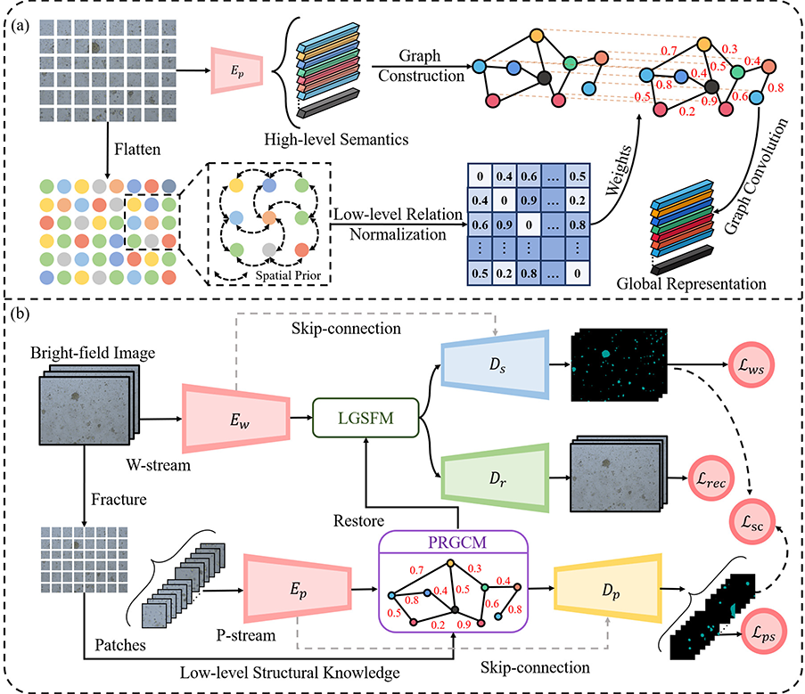

# SCPWRG
This is the official code for "Semantic Consistency-Guided Patch-Wise Relation Graph Reasoning Scheme for Lung Cancer Organoid Segmentation in Brightfield Microscopy"



## Installation and Setup

1. **Hardware requirements**:
   This project requires only a standard computer with enough RAM and a NVIDIA GPU to support operations. We ran the demo using the following specs:
   - CPU: 10 cores, 2.5 GHz/core
   - RAM: 40GB
   - GPU: NVIDIA Quadro RTX 8000 (48GB memory)
   - CUDA: 11.0


2. **System requirements**:
   This tool is supported for Linux. The tool has been tested on the following system:

   - Ubtuntu Linux release 18.04.6

3. **Clone the Repository**:
   ```bash
   git clone https://github.com/yourusername/SCPWRG.git
   cd SCPWRG
   ```

4. **Install Required Packages**:
   The basic environment requirements are:
   - Python: 3.10
   - CUDA: 11.0
   - Pytorch

5. **Model training**:
   ```bash
    python train.py
    ```

Please replace the data path using your specific path in the train.py.

You can customize the training process using the following arguments:

| Argument           | Description                                      | Default    |
|--------------------|------------------------------------------------|------------|
| `--epochs`, `-e`   | Number of training epochs                        | 500       |
| `--batch-size`, `-b` | Batch size for training                         | 1          |
| `--learning-rate`, `-l` | Learning rate for the optimizer              | 1e-5       |
| `--load`, `-f`     | Path to a checkpoint `.pth` file to resume from | None       |
| `--scale`, `-s`    | Downscaling factor for input images              | 1          |
| `--validation`, `-v` | Percentage of data used for validation (0-100) | 20.0       |
| `--amp`            | Enable mixed precision training                   | Disabled   |
| `--bilinear`       | Use bilinear upsampling in the model              | Disabled   |
| `--classes`, `-c`  | Number of output classes                           | 1          |

6. **Model testing**:
   ```bash
    python predict.py
    ```

You can customize the prediction behavior with the following options:

| Argument            | Description                                         | Default                              |
|---------------------|-----------------------------------------------------|------------------------------------|
| `--model`, `-m`     | Path to the model checkpoint file                    | `./checkpoint/checkpoint_epoch501.pth` |
| `--viz`, `-v`       | Visualize images and predicted masks during testing  | Disabled                           |
| `--no-save`, `-n`   | Do not save the predicted masks                       | Disabled                           |
| `--mask-threshold`, `-t` | Threshold to binarize predicted masks            | 0.5                               |
| `--scale`, `-s`     | Scale factor for input images                          | 1                                 |
| `--bilinear`        | Use bilinear upsampling                                | Disabled                          |
